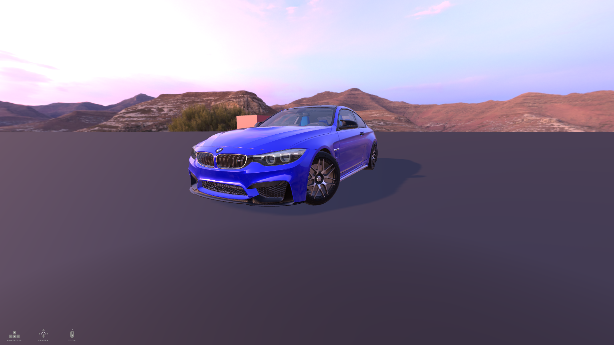

# README.md

# Three.js Car Game

Este projeto é um jogo 3D simples desenvolvido com Three.js, onde o jogador controla um carro em um ambiente virtual. O modelo 3D do carro é carregado a partir de um arquivo GLTF, e o jogo inclui controles básicos de movimentação e rotação.



## Estrutura do Projeto

```
├── assets
│   └── models.png
│       ├── bmw
│       ├── mercedes
│       └── wheel
├── textures
│   ├── cartoonSKY.png
│   ├── print.png
│   └── icoCtrl.png
├── css
│   └── main.css
├── js
│   ├── components
│   │   ├── CameraController.js
│   │   ├── Entity.js
│   │   ├── Environment.js
│   │   ├── GameComponent.js
│   │   ├── Material.js
│   │   └── PLayer.js
│   ├── managers
│   │   ├── InputManager.js
│   │   ├── PerformanceManager.js
│   │   ├── PhysicsManager.js
│   │   ├── VehicleManager.js
│   │   └── UIManager.js
│   ├── loaders
│   │   └── ModelLoader.js
│   └── main.js
├── index.html
└── README.md
```

## Instruções para Configuração

1. **Clone o repositório**:
   ```bash
   git clone <URL_DO_REPOSITORIO>
   cd three-js-app
   ```

2. **Instale as dependências**:
   Certifique-se de ter o Node.js e o npm instalados. Execute o seguinte comando para instalar as dependências necessárias:
   ```bash
   npm install
   ```

3. **Abra o arquivo `index.html` em um navegador**:
   Você pode abrir o arquivo diretamente ou usar o Vite executando `npx vite` no terminal.

## Tecnologias Utilizadas

- Three.js: Biblioteca JavaScript para criar gráficos 3D.
- Cannon.js: Biblioteca JavaScript para criar físicas.
- GLTF: Formato de arquivo eficiente para modelos 3D.
- HTML/CSS: Para a estrutura e estilo da aplicação.

## Contribuições

Contribuições são bem-vindas! Sinta-se à vontade para abrir issues ou pull requests.

## Licença

Este projeto está licenciado sob a MIT License.